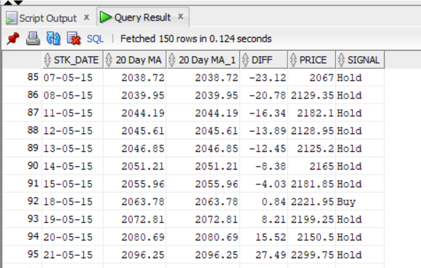

- This is the table with 20 day MA and 50 day MA


- MASTER STOCKS


- BAJAJ2 with  close price and signal


- BAJAJ2 for BUY


- stock report


```
create or replace procedure create_stock_table_with_signal(table_name in varchar2)
is
stmt varchar2(1000);
begin
stmt:='CREATE TABLE '||table_name||'2 AS (
SELECT stk_date, "Close Price",
(CASE	
	WHEN ROW_NUMBER() OVER(order by stk_date) <=50 THEN ''Hold''
	WHEN ("20 Day MA" - "50 Day MA" > 0 AND LAG("20 Day MA" - "50 Day MA") OVER(order by stk_date) > 0 ) THEN ''Hold''
    WHEN ("20 Day MA" - "50 Day MA" < 0 AND LAG("20 Day MA" - "50 Day MA") OVER(order by stk_date) < 0 ) THEN ''Hold''
    WHEN ("20 Day MA" - "50 Day MA" = 0 AND LAG("20 Day MA" - "50 Day MA") OVER(order by stk_date) = 0 ) THEN ''Hold''
    WHEN ("20 Day MA" - "50 Day MA" > 0 AND LAG("20 Day MA" - "50 Day MA") OVER(order by stk_date) < 0 ) THEN ''Buy''
    WHEN ("20 Day MA" - "50 Day MA" < 0 AND LAG("20 Day MA" - "50 Day MA") OVER(order by stk_date) > 0 ) THEN ''Sell''
END ) Signal
from '||table_name||'1)';
    dbms_output.put_line(stmt);
 execute immediate stmt;
end;

- LAG provides access to a row at a given physical offset prior to that position. 

    - means lag makes previous value accessible
```
- for the 1st 50 rows make it as `HOLD`
- when (20d-50d)>0 and previous_day's (20d-50d)>0 -> `HOLD`
- when (20d-50d)>0 and previous_day's (20d-50d)>0 -> `HOLD`
- when (20d-50d)=0 and previous_day's (20d-50d)=0 -> `HOLD`
------------------------------------------

-  when (20d-50d)>0 and previous_day's (20d-50d)<0 -> `BUY` -> `Golden cross`


    - we can see that 


- when (20d-50d)<0 and previous_day's (20d-50d)>0 -> `SELL` -> `Death Cross`


you can retrieve the table using the below query
```

select stk_date,"20 Day MA","20 Day MA","20 Day MA"-"50 Day MA" diff,bajaj1."Close Price" price,signal
FROM bajaj1 
inner JOIN bajaj2
USING(stk_date)

```